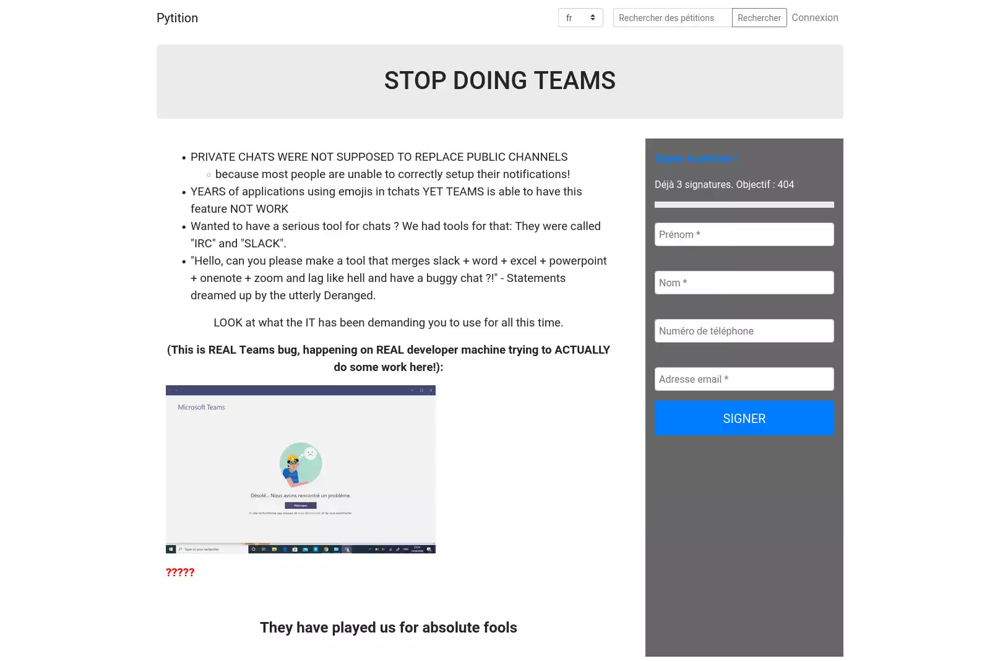

# Pytition pour YunoHost

[](https://dash.yunohost.org/appci/app/pytition)    
[](https://install-app.yunohost.org/?app=pytition)

*[Read this readme in english.](./README.md)*
*[Lire ce readme en français.](./README_fr.md)*

> *Ce package vous permet d'installer Pytition rapidement et simplement sur un serveur YunoHost.
Si vous n'avez pas YunoHost, regardez [ici](https://yunohost.org/#/install) pour savoir comment l'installer et en profiter.*

## Vue d'ensemble

Pytition permet d'héberger des pétitions respectueuses de la vie privée sur votre propre serveur.

### Features

- Hébergez des pétitions sans compromettre l'identité de vos signataires
- Pas de tracking : CSS, JS et autres ressources sont auto-hébergées. Pas d'usage de CDN.
- Interface réactive : fonctione sur smartphones et tablettes autant que sur ordinateur.
- Interface traduite : anglais, français, italien, occitan, espagnol.
- Vous pouvez prévisualiser les pétitions avant publication.
- Simple à utiliser grâce à des éditeurs TinyMCE (comme Wordpress)
- Vous pouvez exporter les signatures via CSV.


**Version incluse :** 2.5.1~ynh1

**Démo :** https://demo.pytition.org

## Captures d'écran



## Avertissements / informations importantes

* Pas de support du Single-Sign-On ou du LDAP Yunohost.

## Documentations et ressources

* Site officiel de l'app : https://github.com/pytition/Pytition
* Documentation officielle de l'admin : https://pytition.readthedocs.io/en/latest/
* Dépôt de code officiel de l'app : https://github.com/pytition/Pytition
* Documentation YunoHost pour cette app : https://yunohost.org/app_pytition
* Signaler un bug : https://github.com/YunoHost-Apps/pytition_ynh/issues

## Informations pour les développeurs

Merci de faire vos pull request sur la [branche testing](https://github.com/YunoHost-Apps/pytition_ynh/tree/testing).

Pour essayer la branche testing, procédez comme suit.
```
sudo yunohost app install https://github.com/YunoHost-Apps/pytition_ynh/tree/testing --debug
ou
sudo yunohost app upgrade pytition -u https://github.com/YunoHost-Apps/pytition_ynh/tree/testing --debug
```

**Plus d'infos sur le packaging d'applications :** https://yunohost.org/packaging_apps