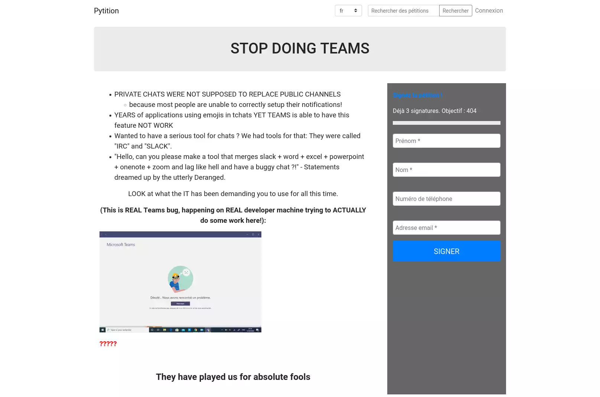

<!--
To README zostało automatycznie wygenerowane przez <https://github.com/YunoHost/apps/tree/master/tools/readme_generator>
Nie powinno być ono edytowane ręcznie.
-->

# Pytition dla YunoHost

[](https://ci-apps.yunohost.org/ci/apps/pytition/)


[](https://install-app.yunohost.org/?app=pytition)

*[Przeczytaj plik README w innym języku.](./ALL_README.md)*

> *Ta aplikacja pozwala na szybką i prostą instalację Pytition na serwerze YunoHost.*  
> *Jeżeli nie masz YunoHost zapoznaj się z [poradnikiem](https://yunohost.org/install) instalacji.*

## Przegląd

Pytition is an application for privacy-friendly online petitions you can host on your own server.

### Features

- Host petitions without compromising the privacy of your signatories.
- No tracking, ever: CSS, JS and all resources are self-hosted. Pytition does not use CDN.
- Responsive UI: works well on phones/tablets/laptops/desktops.
- Multi-lingual UI with i18n: English, French, Italian, Occitan, Spanish.
- You can pre-visualize petitions before publishing them.
- Easy to use: petition content is typed-in via TinyMCE editors (like WordPress).
- You can export signatures in CSV format.


**Dostarczona wersja:** 2.8~ynh4

**Demo:** <https://demo.pytition.org>

## Zrzuty ekranu



## Dokumentacja i zasoby

- Oficjalna strona aplikacji: <https://pytition.org>
- Oficjalna dokumentacja dla administratora: <https://pytition.readthedocs.io/en/latest/>
- Repozytorium z kodem źródłowym: <https://github.com/pytition/Pytition>
- Sklep YunoHost: <https://apps.yunohost.org/app/pytition>
- Zgłaszanie błędów: <https://github.com/YunoHost-Apps/pytition_ynh/issues>

## Informacje od twórców

Wyślij swój pull request do [gałęzi `testing`](https://github.com/YunoHost-Apps/pytition_ynh/tree/testing).

Aby wypróbować gałąź `testing` postępuj zgodnie z instrukcjami:

```bash
sudo yunohost app install https://github.com/YunoHost-Apps/pytition_ynh/tree/testing --debug
lub
sudo yunohost app upgrade pytition -u https://github.com/YunoHost-Apps/pytition_ynh/tree/testing --debug
```

**Więcej informacji o tworzeniu paczek aplikacji:** <https://yunohost.org/packaging_apps>
